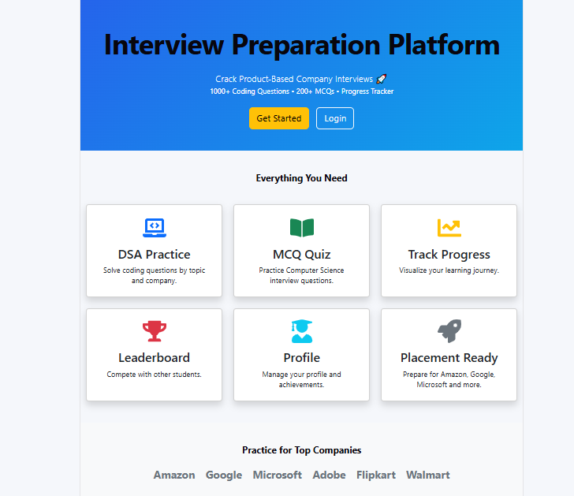
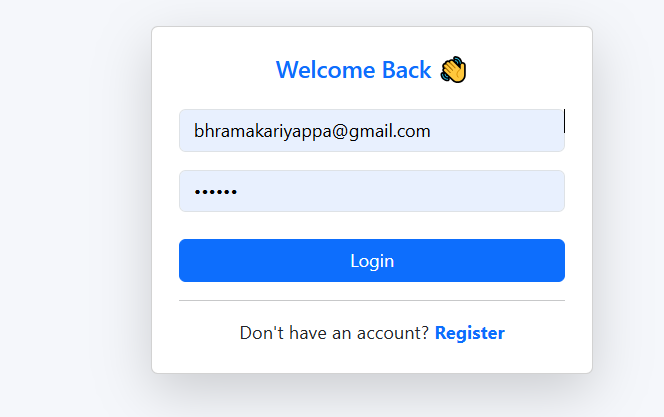
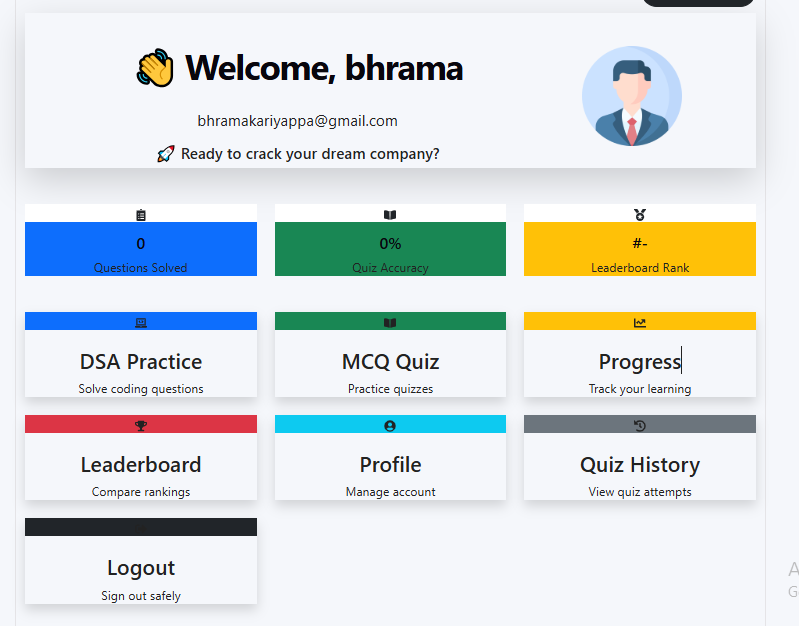
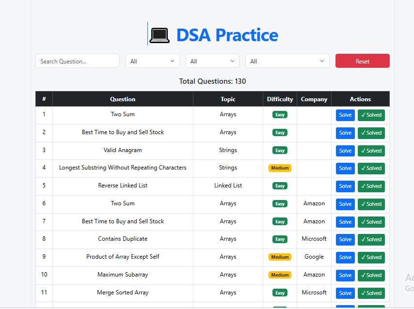
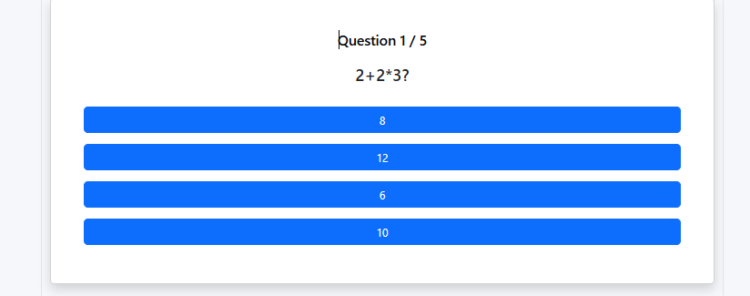
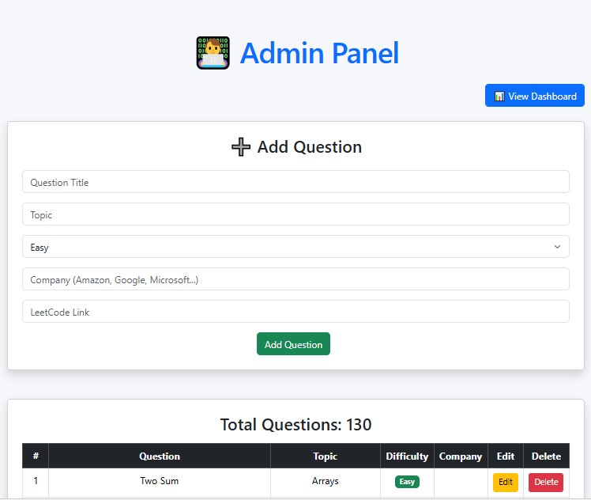
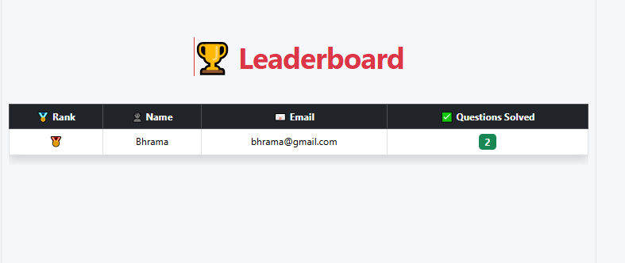

# 🚀 Interview Preparation Platform

A full-stack Interview Preparation Platform built using the MERN Stack (MongoDB, Express.js, React.js, Node.js). The platform helps students prepare for coding interviews by providing DSA practice questions, MCQ quizzes, progress tracking, leaderboards, and an admin panel to manage content.

---

## 📌 Project Description

The Interview Preparation Platform is designed for students preparing for technical interviews. It provides coding questions, computer science quizzes, progress tracking, and leaderboard rankings in one place.

The platform includes separate modules for users and administrators.

---

## 🚀 Features

### 👨‍🎓 User Features

- User Registration & Login
- JWT Authentication
- Dashboard
- DSA Practice Questions
- MCQ Quiz
- Progress Tracker
- Leaderboard
- Profile Management
- Quiz History
- Dark Mode
- Responsive UI

### 👨‍💼 Admin Features

- Admin Login
- Add DSA Questions
- Edit Questions
- Delete Questions
- Manage Quiz Questions
- Manage Users

---

## 🛠 Tech Stack

### Frontend

- React.js
- Bootstrap
- React Router
- Axios

### Backend

- Node.js
- Express.js

### Database

- MongoDB
- Mongoose

### Authentication

- JWT (JSON Web Token)
- Bcrypt.js

---

## 📂 Project Structure

```
Interview-Preparation-Platform
│
├── client
│   ├── src
│   ├── public
│   └── package.json
│
├── server
│   ├── models
│   ├── routes
│   ├── middleware
│   ├── server.js
│   └── package.json
│
└── README.md
```

---

## ⚙ Installation Steps

### 1️⃣ Clone the repository

```bash
git clone https://github.com/bhrama123/Interview-Preparation-Platform.git
```

### 2️⃣ Open the project

```bash
cd Interview-Preparation-Platform
```

### 3️⃣ Install frontend dependencies

```bash
cd client
npm install
```

### 4️⃣ Install backend dependencies

```bash
cd ../server
npm install
```

### 5️⃣ Create a .env file

```env
PORT=5000
MONGO_URI=your_mongodb_connection_string
JWT_SECRET=your_secret_key
```

### 6️⃣ Start Backend

```bash
npm start
```

### 7️⃣ Start Frontend

```bash
cd ../client
npm run dev
```

---

## 📸 Screenshots

### Home Page



### Login Page



### Dashboard



### DSA Practice



### MCQ Quiz



### Admin Panel


### Leaderboard


---

## 🎯 Future Enhancements

- 100+ DSA Questions
- 200+ MCQ Questions
- Company-wise Questions
- Password Reset
- Email Verification
- Resume Builder
- AI Interview Assistant
- Coding Contest Integration

---

## 👨‍💻 Author

**Bhrama K**

GitHub: https://github.com/bhrama123

---

## 📄 License

This project is developed for educational and placement preparation purposes.